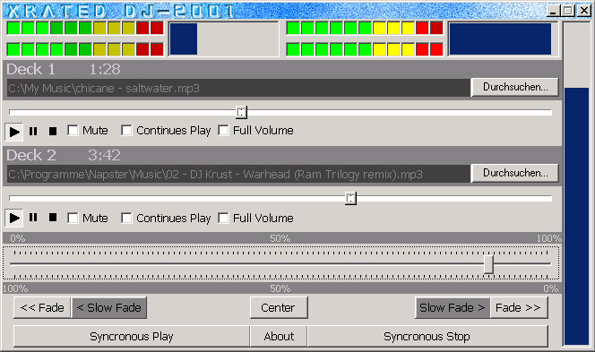



## Xrated DJ\-2001 \- Audio Mixing Machine

### Description

With this Program you can mix 2 Audio files of almost any type in real time. It uses Microsoft Windows Media Player Techniques.
 
### More Info
 
Till now the Visual EQ is fake, if anybody knows how to get them work, plz email me.

             |
---                |---
**Submitted On**   |2000-12-13 23:44:26
**By**             |[Christian Reuter](https://github.com/Planet-Source-Code/PSCIndex/blob/master/ByAuthor/christian-reuter.md)
**Level**          |Intermediate
**User Rating**    |4.6 (23 globes from 5 users)
**Compatibility**  |VB 5\.0, VB 6\.0
**Category**       |[Sound/MP3](https://github.com/Planet-Source-Code/PSCIndex/blob/master/ByCategory/sound-mp3__1-45.md)
**World**          |[Visual Basic](https://github.com/Planet-Source-Code/PSCIndex/blob/master/ByWorld/visual-basic.md)
**Archive File**   |[CODE\_UPLOAD1266612132000\.zip](https://github.com/Planet-Source-Code/christian-reuter-xrated-dj-2001-audio-mixing-machine__1-13577/archive/master.zip)

